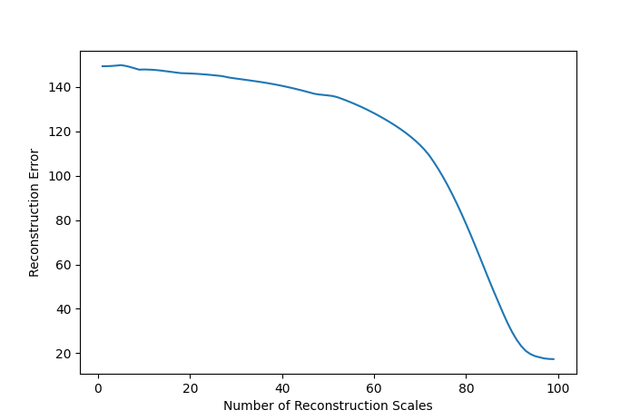

# py_cwt2d

2D continuous wavelet transform in Python

## Quickstart

Install `py_cwt2d` with

```bash
pip install git+https://github.com/LeonArcher/py_cwt2d
```

Import and calculate 2d cwts

```python
import numpy as np
import pywt
import py_cwt2d

# get an image
image = pywt.data.camera()
image = (image - image.min()) / (image.max() - image.min())
# set up a range of scales in logarithmic spacing between 1 and 256 (image width / 2 seems to work ehre)
ss = np.geomspace(1.0,256.0,100)
# calculate the complex pycwt and the wavelet normalizations
coeffs, wav_norm = py_cwt2d.cwt_2d(image, ss, 'mexh')
# plot an image showing the combinations of all the scales
errors = []
N = 10
fig, axes = plt.subplots(nrows=N, ncols=N, figsize=(15, 15))
for level in range(len(ss)):
    i = level // N
    j = level % N
    plt.sca(axes[i, j])
    plt.axis('off')
    C = 1.0 / (ss[:level] * wav_norm[:level])
    reconstruction = (C * np.real(coeffs[..., :level])).sum(axis=-1)
    reconstruction = 1.0 - (reconstruction - reconstruction.min()) / (reconstruction.max() - reconstruction.min())
    errors.append(np.sqrt(np.sum(np.power(reconstruction - image, 2.0))))
    plt.imshow(reconstruction, cmap='gray')
plt.show()
fig2, ax2 = plt.subplots(nrows=1, ncols=1, figsize=(6, 6/1.618))
plt.plot(errors, label='norm')
plt.xlabel('Number of Reconstruction Scales')
plt.ylabel('Reconstruction Error')
plt.show()
```


